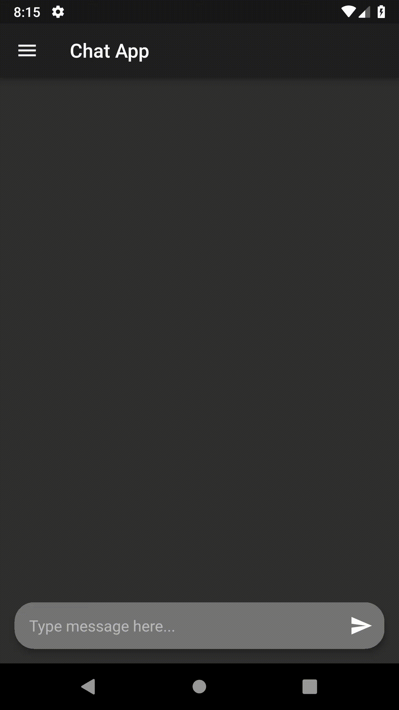

<h1 align="center">1Chatβ</h1>

Flutter and Firestre powered Chat Application

## Demo

## Features

- You can send text messages
- One can delete their own texts.
- Send Image using camera and gallery
- Open Image in a hero animation

## ToDos

- Fix unwanted keyboard padding.
- Fix image hero container size.
- Add Delete image feature
- Add Loading Bar when uploading images.
- Add send image from Gallery button (Not able to add multiple prefix icons)
- Implement multiple chatrooms (After we complete single one)

## Author

[Aashutosh Rathi](https://github.com/aashutoshrathi)

Icons made by <a href="https://www.flaticon.com/authors/smashicons" title="Smashicons">Smashicons</a> from <a href="https://www.flaticon.com/" title="Flaticon">www.flaticon.com</a> is licensed by <a href="http://creativecommons.org/licenses/by/3.0/" title="Creative Commons BY 3.0" target="_blank">CC 3.0 BY</a>

